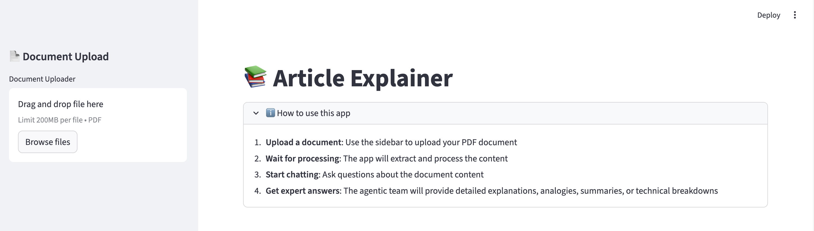
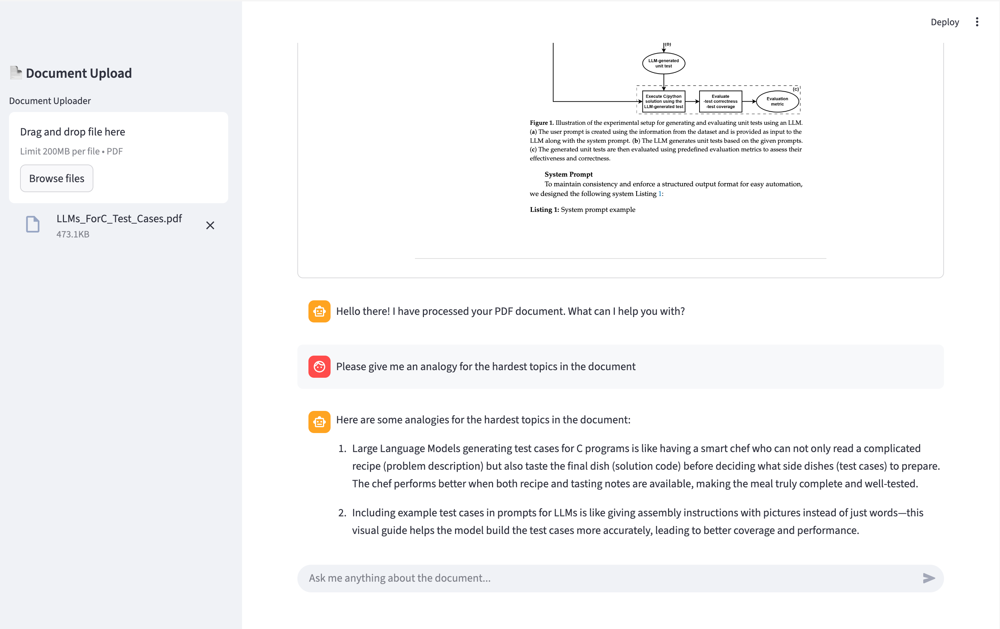

# Article Explainer

An intelligent document analysis tool that helps you understand complex technical articles through AI-powered
explanations, analogies, and summaries.

## Features

- **PDF Upload & Processing**: Upload technical documents and get instant analysis
- **Multi-Expert System**: Four specialized agents work together to provide comprehensive explanations
- **PDF Viewer**: See your PDF within the main page for added context
- **Interactive Chat Interface**: Ask questions and get tailored responses
- **Smart Collaboration**: Agents automatically work together for complex queries
- **Document Analysis Tools**: Extract key terms, analyze structure, and assess complexity

## Application

### Usage explanation and interface


### Interactive chat with the agentic team



## Quick Start

### Installation

1. Install dependencies:

```bash
uv sync
```

2. Set up environment variables:

```bash
export OPENAI_API_KEY="your-api-key-here"
```

### Usage

#### Docker 

1. Build and run with Docker Compose:

```bash
docker-compose up --build
```

2. Open your browser at `http://localhost:8501`

#### Web Interface (Local development)

Launch the Streamlit web interface:

```bash
uv run streamlit run streamlit_app.py
```

1. Open your browser at `http://localhost:8501`

## Example Queries

- "Summarize this document"
- "Explain the most complex concepts with analogies"
- "Show me the code examples and explain how they work"
- "Give me a TL;DR with the key technical details"
- "What are the main algorithms discussed?"
