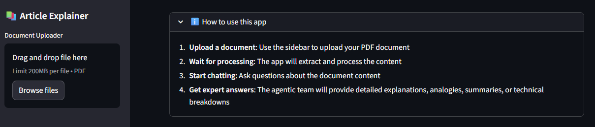
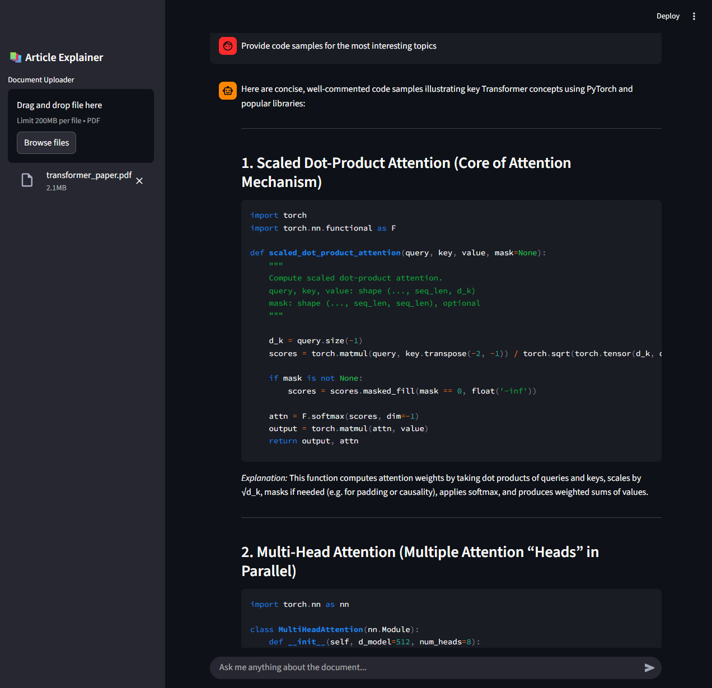

<div align="center">

# 🤖 Article Explainer
### AI-Powered Document Analysis with Multi-Agent Intelligence

Transform complex technical documents into crystal-clear insights using a **team of specialized AI agents** working in perfect harmony.

[](https://www.python.org/)
[](https://streamlit.io/)
[](https://langchain-ai.github.io/langgraph/)
[](https://github.com/langchain-ai/langgraph-swarm)
[](https://ollama.com/)
[](https://opensource.org/licenses/MIT)

[🚀 Quick Start](#-quick-start) • [✨ Features](#-features) • [🏗️ Architecture](#-architecture) • [🤝 Contributing](#-contributing)

</div>

---

## 🎯 The Problem & Our Solution

Ever struggled to understand a dense technical paper? Wrestling with complex documentation? Drowning in jargon?

**Article Explainer** flips the script. Instead of fighting through walls of text, you upload a PDF and get **five specialized AI agents** working together to illuminate every angle—summaries, analogies, code examples, technical deep-dives, and security considerations.

It's like having a dream team of experts in your pocket. 🎯

---

## ✨ What Makes This Special

### 🧠 Multi-Agent Intelligence
Not one AI, but **five specialized agents** that collaborate and hand off tasks intelligently. Each brings unique expertise:
- **Summarizer** → Distills complexity into clarity
- **Explainer** → Breaks down concepts step-by-step  
- **Analogy Creator** → Makes the abstract tangible
- **Developer** → Provides working code examples
- **Vulnerability Expert** → Surfaces risks & considerations

### 🌐 Flexible & Private
Run with **OpenAI's cutting-edge models** for maximum power, or keep everything **local with Ollama** for complete privacy. Your choice.

### 💬 Conversational Context
Ask follow-ups, dig deeper, ask "why?"—the agents maintain full document context across the entire conversation.

---

## 📸 See It In Action




---

## 🎁 Core Features

| 🎯 Capability                  | 💡 Powered By          | 🛠️ Built With        |
| ----------------------------- | --------------------- | ------------------- |
| Upload & analyze PDFs         | Document Intelligence | PyPDF2, LangChain   |
| Ask questions naturally       | LLM Understanding     | GPT-4o or Ollama    |
| Get expert perspectives       | Multi-Agent Swarm     | LangGraph Swarm     |
| Maintain conversation history | Context Preservation  | Vector embeddings   |
| Real-time responses           | Optimized Processing  | Async/await         |
| Private or cloud-based        | Flexible Deployment   | OpenAI API or Local |

### What You Can Do

```
📝 "Summarize this in 3 bullet points"
   → Instant, crystal-clear summary

🧮 "Explain using simple analogies"  
   → Complex ideas become obvious

💻 "Show me code examples"
   → Production-ready implementations

🔒 "Any security concerns?"
   → Expert vulnerability analysis

🤔 "What's the key innovation?"
   → Technical breakdown & context

📊 "Give me a TL;DR with the main arguments"
   → High-level executive summary
```

---

## 🚀 Quick Start

### Prerequisites
- **Python 3.9+** (3.11+ recommended)
- **Ollama** (optional, for local AI) or OpenAI API key
- **Git**

### Installation (5 minutes)

```bash
# 1️⃣ Clone the repo
git clone https://github.com/EloiRamos/article-explainer.git
cd article-explainer

# 2️⃣ Install dependencies
pip install -r requirements.txt

# 3️⃣ Set up environment
cp .env.example .env
# Edit .env with your OpenAI key OR Ollama URL
```

### Configuration

**Option A: Cloud-Powered (OpenAI)**
```bash
# .env
OPENAI_API_KEY="sk-..."
```

**Option B: Privacy-First (Local Ollama)**
```bash
# Terminal 1: Start Ollama
ollama pull qwen3:4b
ollama serve

# .env
OLLAMA_BASE_URL="http://localhost:11434"
OLLAMA_MODEL="qwen3:4b"
```

### Launch

```bash
streamlit run article_explainer_page.py
```

Open `http://localhost:8501` and start analyzing! 🎉

---

## 🏗️ Architecture

Under the hood, this is elegantly orchestrated:

```
┌──────────────────────────────────────────────────────┐
│           Streamlit Web Interface                    │
│        (PDF Upload, Chat, Real-time UI)              │
└──────────────────┬───────────────────────────────────┘
                   │
                   ▼
┌──────────────────────────────────────────────────────┐
│         LangGraph Swarm Orchestrator                 │
│     (Intelligent Agent Routing & Handoffs)           │
└──────────────────┬───────────────────────────────────┘
                   │
        ┌──────────┼──────────┬──────────┬─────────┐
        ▼          ▼          ▼          ▼         ▼
   ┌─────────┐┌─────────┐┌─────────┐┌─────────┐┌──────────┐
   │Summariz.││Explainer││Analogy  ││Developer││Vulnerab. │
   │ Agent   ││ Agent   ││Creator  ││ Agent   ││  Expert  │
   └─────────┘└─────────┘└─────────┘└─────────┘└──────────┘
        │          │          │          │         │
        └──────────┼──────────┴──────────┴─────────┘
                   ▼
        ┌──────────────────────┐
        │  LLM Provider        │
        │ (OpenAI or Ollama)   │
        └──────────────────────┘
```

### How It Works

1. **You upload a PDF** → App extracts text & builds document context
2. **You ask a question** → Orchestrator routes to best-fit agent(s)
3. **Agents collaborate** → They can hand off to each other as needed
4. **You get insight** → Detailed, multi-perspective response
5. **Conversation continues** → Full context preserved for follow-ups

---

## 📁 Project Structure

```
article-explainer/
├── .env.example              # Environment variables template
├── .pre-commit-config.yaml   # Pre-commit hooks configuration
├── .gitignore               # Git ignore patterns
├── article_explainer_page.py # Main Streamlit application
├── pyproject.toml           # Python project configuration
├── requirements.txt         # Python dependencies
├── uv.lock                  # UV package manager lock file
├── pytest.ini              # Test configuration
├── logging.conf             # Logging configuration
├── Makefile                 # Build automation
├── Dockerfile               # Docker container configuration
├── docker-compose.yml       # Docker Compose configuration
├── LICENSE                  # MIT License file
├── README.md                # Project documentation
├── config/                  # Configuration management
│   ├── settings.py          # Pydantic settings with validation
│   └── __init__.py
├── data/                    # Project data and assets
│   ├── sample_pdfs/         # Example PDF documents
│   │   ├── DeepSeek-OCR.pdf
│   │   └── transformer_paper.pdf
│   └── screenshots/         # Application UI screenshots
│       ├── img.png
│       └── main_interface.png
├── docs/                    # Documentation files
│   └── small_language_models.pdf
├── explainer/               # Core AI agent logic
│   ├── service/             # Utilities and services
│   │   ├── config.py
│   │   └── content_loader.py
│   ├── graph.py             # Multi-agent orchestration
│   ├── prompts.py           # Agent system prompts
│   └── __init__.py
├── logs/                    # Application logs
│   └── app.log
└── tests/                   # Test suite
    ├── __init__.py
    ├── conftest.py
    └── test_config.py
```

---

## ⚙️ Development

### Run Tests
```bash
# All tests with coverage
pytest --cov=explainer --cov-report=html

# Watch mode (on file changes)
pytest-watch
```

### Code Quality
```bash
# Format
black .

# Lint
ruff check . --fix

# Type check
mypy .

# Pre-commit
pre-commit run --all-files
```

---

## 🔧 Performance & Compatibility

### AI Model Options

| Provider   | Model       | Privacy | Speed    | Best For                       |
| ---------- | ----------- | ------- | -------- | ------------------------------ |
| **OpenAI** | GPT-4o-mini | Cloud   | ⚡⚡⚡ Fast | Production, complex docs       |
| **Ollama** | Qwen3:4b    | Local   | ⚡ Medium | Privacy-sensitive, development |

### System Requirements

- **Minimum**: Python 3.9+, 4GB RAM, 2GB storage
- **Recommended**: Python 3.11+, 8GB+ RAM, GPU (for Ollama)

### Supported Formats

- ✅ PDF (primary, optimized for multi-page)
- ✅ Complex layouts & scanned documents
- 🔄 Coming: DOCX, TXT, Markdown

---

## 📊 Real-World Use Cases

- **📚 Academic Research** → Understand papers faster, explore concepts deeply
- **💼 Technical Documentation** → Parse complex specs and APIs  
- **🔐 Security Reviews** → Vulnerability analysis on technical docs
- **📖 Learning & Onboarding** → New team members master concepts faster
- **🏢 Compliance** → Digest regulatory documents with context
- **🚀 Product Research** → Quickly understand competitor tech

---

## 📜 License

MIT License — Use freely, modify, distribute. See [LICENSE](LICENSE).

---

## 🙏 Built On Giants

- **LangChain & LangGraph** – The agent orchestration backbone
- **Streamlit** – Beautiful interfaces with Python
- **Ollama** – Local AI made simple
- **OpenAI** – Frontier AI models

---

<div align="center">

**Made with ❤️ by AI engineers, for AI engineers**

*Transform complexity into clarity. One document at a time.*

</div>